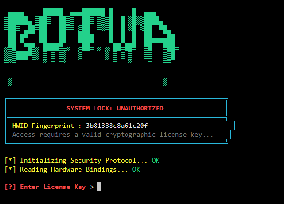
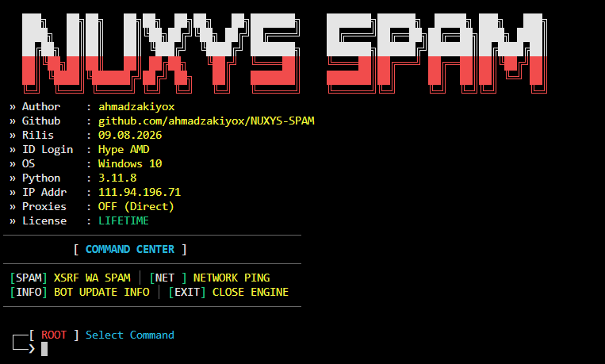

<div align="center">

# 🔥 NUXYS-SPAM 🔥
**The Ultimate High-Speed Messaging Automation Tool**

[]()
[]()
[]()

</div>

---

## ⚡ Apa itu NUXYS-SPAM?
**NUXYS-SPAM** adalah *tools* otomatisasi pengiriman pesan tingkat lanjut yang dirancang untuk performa dan kecepatan maksimal. Dilengkapi dengan sistem keamanan canggih dan proteksi anti-ban mutakhir, menjadikan *tools* ini salah satu yang terbaik di kelasnya.

---

## ✨ Fitur Unggulan
- 🚀 **Performa Ekstrem**: Mengeksekusi ratusan perintah dalam hitungan detik tanpa jeda.
- 🛡️ **Keamanan Tingkat Tinggi**: Menggunakan sistem proteksi eksklusif untuk kenyamanan pengguna.
- 🌐 **Sistem Auto-Bypass**: Melewati berbagai rintangan proteksi jaringan secara mulus.
- 💻 **Desain Elegan**: Antarmuka berbasis teks (CLI) yang futuristik dan mudah digunakan.

---

## 📸 Tampilan Program
Berikut adalah cuplikan antarmuka dari NUXYS-SPAM:

**🔹 Halaman Login (License Verification)**


**🔹 Command Center (Menu Utama)**


---

## 🛠️ Instalasi & Cara Penggunaan

Ikuti instruksi berikut untuk mulai menggunakan program:

### 1. Persiapan
Pastikan Python sudah terinstal di perangkat Anda. Buka terminal/CMD dan jalankan perintah berikut untuk menginstal dependensi:
```bash
pip install -r requirements.txt
```

### 2. Jalankan Program
Mulai program dengan mengeksekusi file utama:
```bash
python main.py
```

### 3. Aktivasi Lisensi
Saat pertama kali masuk, Anda akan dimintai **Kode Lisensi** rahasia. 
⚠️ *Dilarang keras memasukkan kode sembarangan. Pelanggaran akan mengakibatkan akses Anda diblokir permanen oleh sistem.*

---

## 📞 Pemesanan Lisensi Resmi
Belum memiliki lisensi? Ingin berlangganan akses VIP? Silakan hubungi pembuat secara langsung melalui tautan resmi di bawah ini:

[](https://t.me/ahmadzakiyo)
[](https://www.threads.net/@ahmadzaki_yo)

---

<div align="center">
  <i>Dibuat dengan ❤️ oleh <b>ahmadzakiyox</b> | © 2026 All Rights Reserved</i>
</div>
